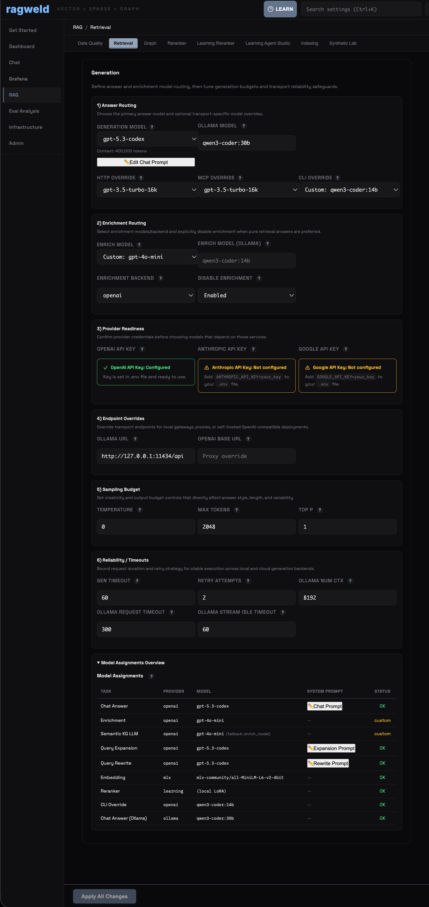
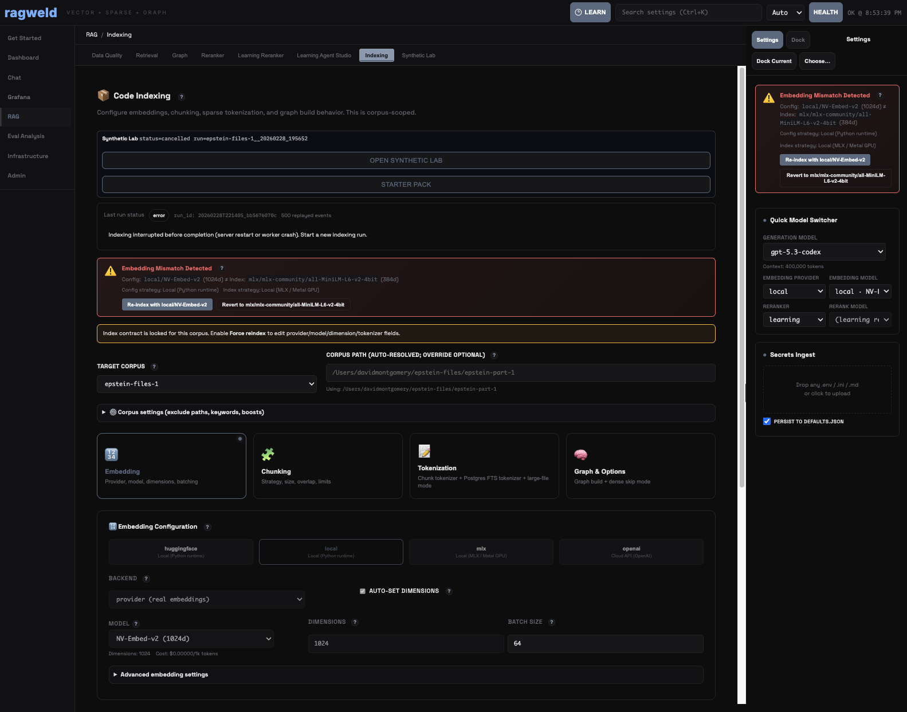
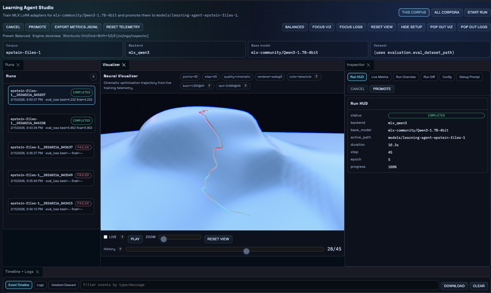
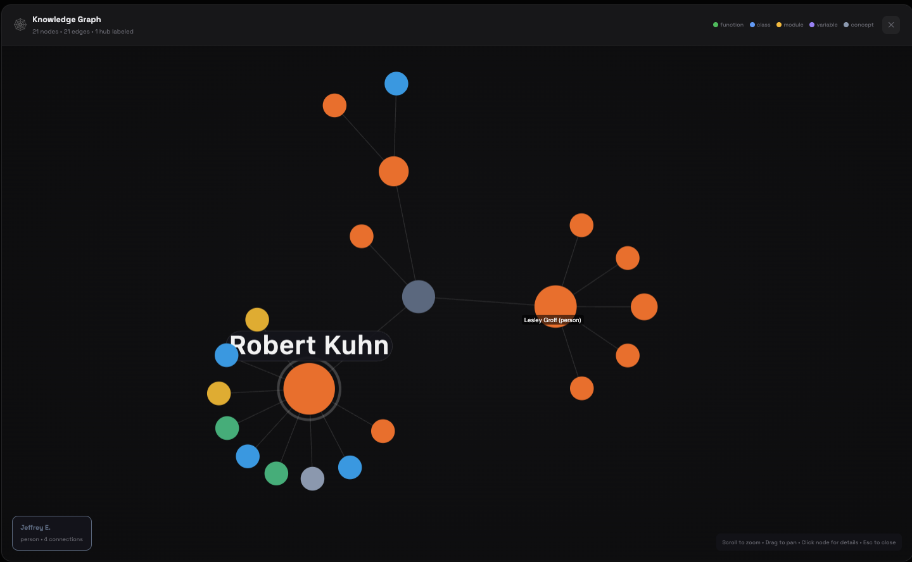
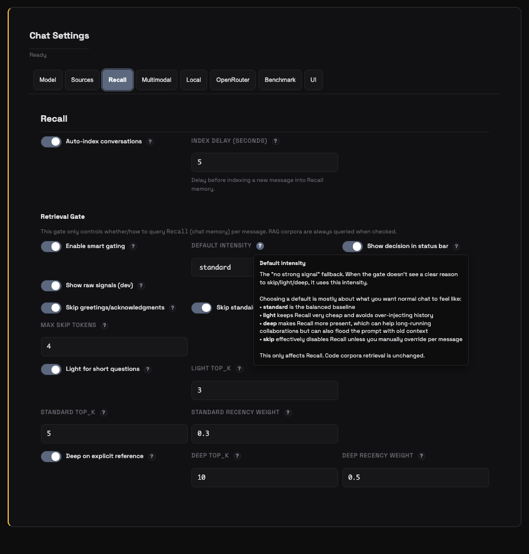
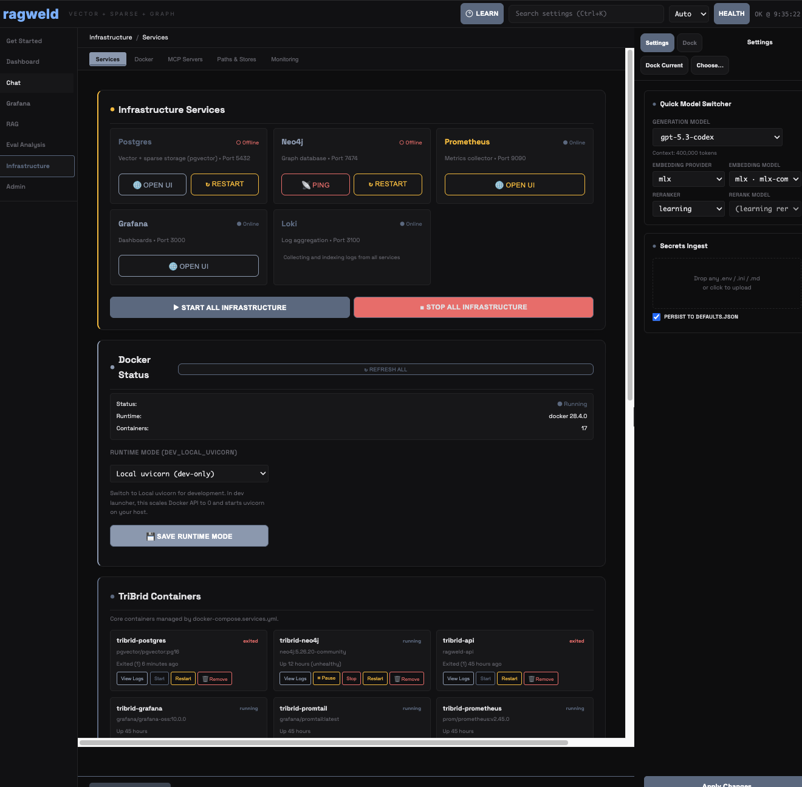
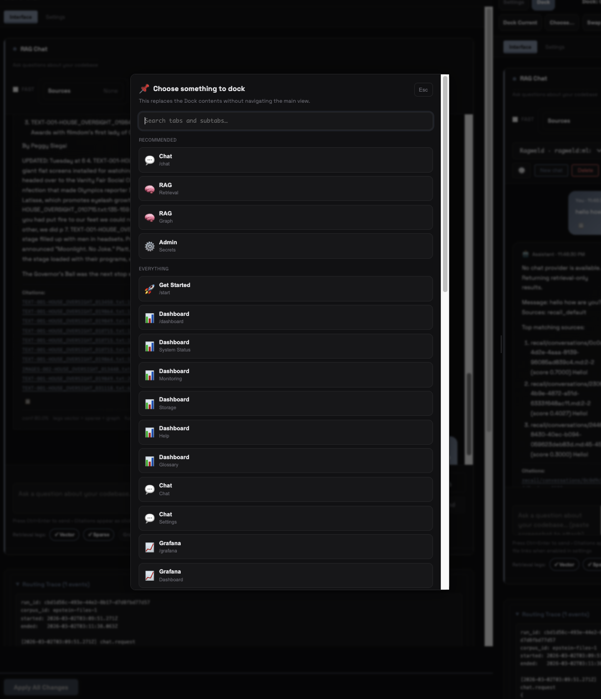

# ragweld.com

> See inside your RAG pipeline. Then fix it.

This repo powers the public ragweld site and live hosted demo. It is the product-facing surface for the open-source ragweld MLOps Engineering Platform: API-first retrieval orchestration, tri-brid search, synthetic data + eval workflows, dual training studios, and observability tooling.

## Live Surfaces

- Local workspace: `../ragweld.com` or `ragweld.com`
- Live site: [https://ragweld.com/](https://ragweld.com/)
- Live demo: [https://ragweld.com/demo/](https://ragweld.com/demo/)
- Glossary: [https://ragweld.com/glossary/](https://ragweld.com/glossary/)
- Learning Ranker deep link: [https://ragweld.com/demo/rag?subtab=learning-ranker](https://ragweld.com/demo/rag?subtab=learning-ranker)
- Docs (default settings/config view): [https://dmontgomery40.github.io/ragweld/latest/configuration/](https://dmontgomery40.github.io/ragweld/latest/configuration/)

## What ragweld is (from the website)

- API-first MLOps engineering platform for retrieval + agent systems.
- MCP support is built in, but API is the primary production contract.
- Three retrieval legs, independently tunable: vector + sparse (BM25) + graph.
- Synthetic Data Lab and eval workflows for regression-resistant iteration.
- Dual training studios (reranker + agent adapters) with promotion controls.
- Benchmark + eval workflow: run, compare, drill down, and ship changes based on evidence.
- Learning reranker: Qwen3-style yes/no logits scoring plus LoRA training from feedback.
- Embedded observability: tracing + Grafana split-view inside the workbench.
- Alerting hooks: threshold-based webhook alerts for quality and latency regressions.
- MCP-native: use ragweld capabilities from IDEs, agents, and automation clients.
- Parameter glossary: searchable reference for the full config surface.

## Current Screenshot Set

### 1) API routing control plane (API first, MCP override second)



- Docs: [API](https://dmontgomery40.github.io/ragweld/latest/api/) · [MCP integration](https://dmontgomery40.github.io/ragweld/latest/integrations/mcp/)

### 2) Indexing guardrails and mismatch detection



- Docs: [Indexing manual](https://dmontgomery40.github.io/ragweld/latest/manual/indexing/) · [Indexing config](https://dmontgomery40.github.io/ragweld/latest/reference/config/indexing/)

### 3) Learning Agent Studio run HUD + promotion controls



- Docs: [Training config](https://dmontgomery40.github.io/ragweld/latest/reference/config/training/) · [Reranker workflow](https://dmontgomery40.github.io/ragweld/latest/howto/reranker/)

### 4) Graph explorer for entity/relationship retrieval



- Docs: [Retrieval overview](https://dmontgomery40.github.io/ragweld/latest/retrieval/overview/) · [Graph search config](https://dmontgomery40.github.io/ragweld/latest/reference/config/graph_search/)

### 5) Recall gating and memory controls



- Docs: [Chat config](https://dmontgomery40.github.io/ragweld/latest/reference/config/chat/) · [Semantic cache config](https://dmontgomery40.github.io/ragweld/latest/reference/config/semantic_cache/)

### 6) Infrastructure services + runtime controls



- Docs: [Operations](https://dmontgomery40.github.io/ragweld/latest/operations/) · [Observability](https://dmontgomery40.github.io/ragweld/latest/observability/)

### 7) Knowledge graph canvas drilldown


- Docs: [Graph retrieval](https://dmontgomery40.github.io/ragweld/latest/retrieval/graph/) · [Graph search config](https://dmontgomery40.github.io/ragweld/latest/reference/config/graph_search/)

### 8) Dockable workspace chooser



- Docs: [UI manual](https://dmontgomery40.github.io/ragweld/latest/manual/ui/) · [Configuration](https://dmontgomery40.github.io/ragweld/latest/configuration/)
## Quickstart

```bash
# Install root dependencies
npm install

# Install demo dependencies (vendored React app)
npm run deps:demo

# Start Astro site in dev mode
npm run dev

# Run full local stack (Astro + Netlify Functions)
netlify dev

# Build demo + site for production
npm run build

# Preview production output
npm run preview
```

## Demo Behavior

The hosted demo at `/demo/` runs the vendored React app in `vendor/demo`.

- Default mode: core RAG endpoints call live backend routes under `/api/*`.
- Mock fallback: append `?mock=1` to force full MSW demo mocks.

Useful URLs:

- `/demo/?corpus=epstein-files-1`
- `/demo/rag?subtab=learning-ranker&corpus=epstein-files-1`
- `/demo/start`
- `/glossary/`

## Architecture

- Astro landing site: `src/`
- Vendored demo app: `vendor/demo/` (built with Vite, served at `/demo/`)
- Hosted API: `netlify/functions/api.js` (mapped from `/api/*`)
- Deploy/runtime config: `netlify.toml`

High-level flow:

1. Astro renders marketing pages and embeds/links the live demo.
2. `/demo/*` serves the vendored React GUI.
3. GUI calls same-origin `/api/*` endpoints.
4. Netlify Function routes and serves backend responses (Neon-backed via Netlify DB).

## Sync + Deploy (concise)

```bash
# Sync demo UI from sibling ragweld repo
npm run sync:demo

# Build and validate distributable output
npm run build
```

Netlify build config in this repo uses:

- Build command: `npm run build && node scripts/validate-demo.cjs`
- Publish directory: `dist`

## Quality Checks

```bash
# End-to-end tests
npm run test:e2e

# Single spec
npx playwright test tests/e2e/landing.spec.ts
```

## License

MIT
